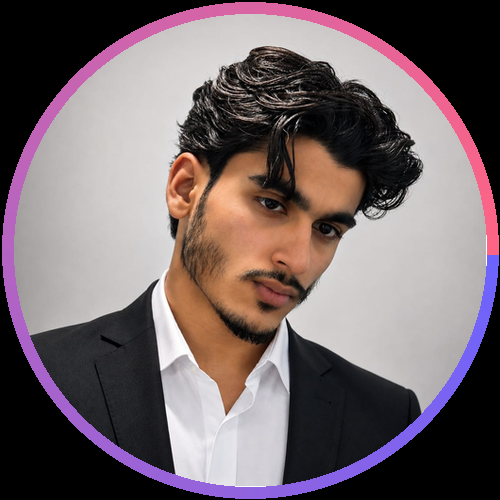

<div align="center">


<!-- Replace the image source below with your own profile photo -->


<h1>Building Digital Systems That Actually Work.</h1>


<br/>


<br/><br/>

<a href="https://github.com/AbdulRehman-webcoder"></a>
<a href="https://www.linkedin.com/in/abdul-rehman-82599b426"></a>
<a href="https://www.instagram.com/1_abdul_rehman?igsi=YTVkcDdndWNtaWV5"></a>
<a href="https://wa.me/923182784433"></a>
<a href="mailto:abdulrehman919first@gmail.com"></a>
<a href="https://abdulrehman-portfolio.xo.je/"></a>

</div>

---

<div align="center">

## ⚡ ENGINEERING PROFILE

</div>

```js
const abdulRehman = {
    role: "Full-Stack Web Developer",
    mindset: "Build. Deploy. Evolve.",
    backend: ["PHP", "Laravel", "REST APIs"],
    frontend: ["HTML5", "CSS3", "JavaScript", "Bootstrap"],
    database: ["MySQL"],
    tools: ["Git", "GitHub", "VS Code"],
    cms: ["WordPress"],
    focus: [
        "Web Applications",
        "Deployment Systems",
        "Image Processing",
        "Automation",
        "Scalable Backend Architecture"
    ],
    status: "Building real-world projects",
    collaboration: "Open to opportunities & freelance projects"
};
```

---

<div align="center">

## 🧠 WHAT I BUILD

<table>
<tr>
<td width="33%" align="center">

### ⚙️ Web Systems
Production-focused applications with clean UI, structured backend logic and database-driven workflows.

</td>
<td width="33%" align="center">

### 🚀 Deployment
Systems designed around deployment, hosting, domains, databases and multi-stack applications.

</td>
<td width="33%" align="center">

### 🤖 Automation
Practical tools and workflows that reduce repetitive work and turn ideas into usable systems.

</td>
</tr>
</table>

</div>

---

<div align="center">

## 🚀 FEATURED PROJECTS

</div>

### 🌐 LionX — Multi-Stack Deployment Platform

> **Deploy. Manage. Evolve.**

A deployment and hosting platform designed to support applications across multiple programming ecosystems, with database support and a path toward free/paid hosting and custom-domain workflows.

**Core vision**

- 🧩 Multi-language application support
- 🗄️ Database-enabled deployments
- 🌍 Custom domain support
- 🚀 Deployment-focused workflow
- 📦 Free & paid hosting model
- ⚡ Built to evolve into a larger infrastructure platform

**Stack**

`PHP` `Laravel` `MySQL` `JavaScript` `REST APIs` `Git`

**Repository:** `Add LionX repository link here`

---

### 🖼️ ImagoAI — Intelligent Image Toolkit

> **Compare. Compress. Convert. Remember.**

A web-based image utility platform focused on practical image processing workflows.

| Feature | What it does |
|---|---|
| 🔍 **Image Comparison** | Compare two images with intelligent similarity detection |
| 📦 **Compression** | Reduce image size while preserving visual quality |
| 🔄 **Format Conversion** | Convert JPG, PNG and WEBP instantly |
| 🕘 **History** | Access previous comparisons from the dashboard |

**Live Website:** [ImagoAI](https://abdulrehman-portfolio.xo.je/)

**Repository:** `Add ImagoAI repository link here`

---

### 💻 Abdul Rehman Portfolio

> **My digital developer headquarters.**

A personal portfolio for presenting projects, capabilities, development work and professional presence.

**Live Portfolio:** [abdulrehman-portfolio.xo.je](https://abdulrehman-portfolio.xo.je/)

**Repository:** `Add portfolio repository link here`

---

<div align="center">

## 🛠️ TECH ARSENAL

### Languages & Frontend


### Backend & Frameworks


### Database, CMS & Tools


</div>

---

<div align="center">

## 📊 GITHUB ENGINEERING METRICS


<br/>


<br/>


<br/>


</div>

---

<div align="center">

## 🐍 CONTRIBUTION SNAKE

<picture>
  <source media="(prefers-color-scheme: dark)" srcset="https://raw.githubusercontent.com/AbdulRehman-webcoder/AbdulRehman-webcoder/output/github-contribution-grid-snake-dark.svg">
  <source media="(prefers-color-scheme: light)" srcset="https://raw.githubusercontent.com/AbdulRehman-webcoder/AbdulRehman-webcoder/output/github-contribution-grid-snake.svg">
  
</picture>

</div>

---

<div align="center">

## 🎯 CURRENT FOCUS

```text
████████████████████████████████████████████  Full-Stack Development
██████████████████████████████████████████    Laravel & Backend Systems
████████████████████████████████████████      Deployment & Infrastructure
██████████████████████████████████████        Automation
████████████████████████████████████          Advanced Web Applications
```

</div>

---

<div align="center">

## 🌐 DIGITAL PRESENCE

<a href="https://github.com/AbdulRehman-webcoder">

</a>

<a href="https://www.linkedin.com/in/abdul-rehman-82599b426">

</a>

<a href="https://abdulrehman-portfolio.xo.je/">

</a>

<a href="mailto:abdulrehman919first@gmail.com">

</a>

</div>

---

<div align="center">

## 🤝 LET'S BUILD SOMETHING REAL

**Open to junior / entry-level opportunities, remote work, freelance projects and ambitious web products.**

<a href="mailto:abdulrehman919first@gmail.com">

</a>

<br/><br/>


</div>
